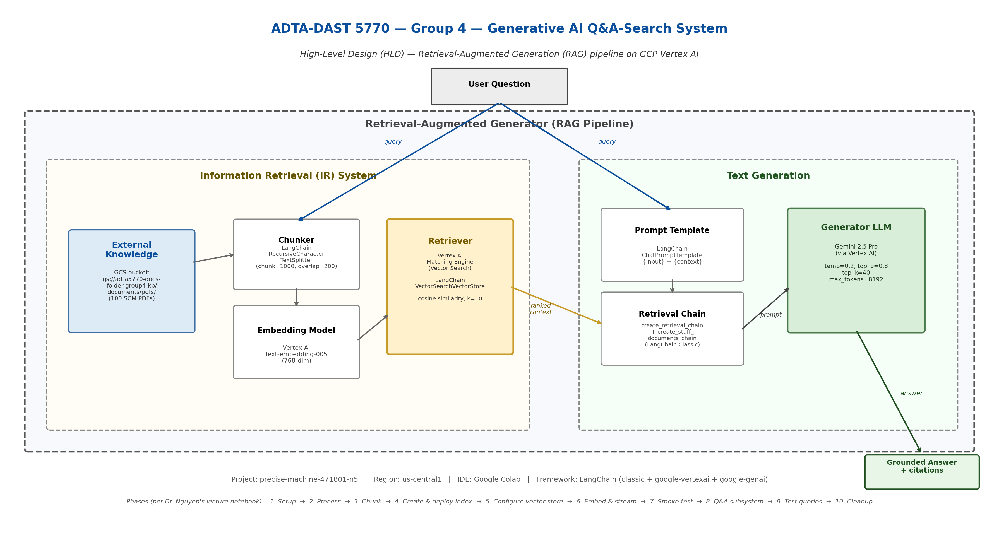

# Generative AI Project Portfolio (Group 4)

> **Two end-to-end Generative AI systems built across two semesters at the University of North Texas, M.S. in Advanced Data Analytics.**

[](https://www.python.org/)
[](https://cloud.google.com/vertex-ai)
[](https://deepmind.google/technologies/gemini/)
[](https://www.langchain.com/)
[](https://jupyter.org/)
[](https://adta-5760-group-4.vercel.app)
[](LICENSE)

---

## 📋 Repository Overview

| Project | Course | Tech | Status |
|---|---|---|---|
| 🎯 **[Sustainable SCM Q&A Search System](./adta5770-rag-qa-system/)** | ADTA 5770: Generative AI with LLMs | Vertex AI · Gemini 2.5 Pro · LangChain · RAG | ✅ Spring 2026, Final |
| 📚 **[Contaminated Knowledge Base for LLM Testing](#-companion-project-contaminated-knowledge-base-for-llm-testing)** | ADTA 5760: NLP with Neural Networks | HTML · CSS · JS · Vercel | ✅ Fall 2025 |

---

# 🎯 Featured Project: Sustainable Supply Chain Management Q&A Search System

A **production-grade Retrieval-Augmented Generation (RAG)** pipeline that answers natural-language questions about Sustainable Supply Chain Management, grounded in a curated knowledge base of **100 academic and industry PDFs**. Built end-to-end on **Google Cloud Platform Vertex AI** with **Gemini 2.5 Pro** as the generator and **Matching Engine** as the vector store.

The system retrieves relevant context using semantic search, generates grounded answers with cited sources, and, critically, **refuses to hallucinate** when asked about topics outside its corpus.

## 🏗️ Architecture



The system implements the canonical RAG pattern, decomposed into two cooperating subsystems:

- **Information Retrieval (IR):** `100 PDFs → Chunker → Embedding Model → Vector Store → Retriever`
- **Text Generation:** `Prompt Template → Retrieval Chain → Generator LLM`

A user query is routed simultaneously to the retriever (which produces ranked context from the knowledge base) and the prompt template. The combined prompt is passed to Gemini, which produces a grounded, cited answer.

## 🛠️ Technology Stack

| Layer | Technology | Configuration |
|---|---|---|
| **Cloud Platform** | Google Cloud Platform Vertex AI | `precise-machine-471801-n5` · `us-central1` |
| **Vector Store** | Vertex AI Matching Engine (tree-AH index) | STREAM_UPDATE for real-time ingestion |
| **Embedding Model** | `text-embedding-005` | 768-dim vectors |
| **Generator LLM** | Gemini 2.5 Pro | `temp=0.2, top_p=0.8, top_k=40, max_tokens=8192` |
| **Orchestration** | LangChain (modern API) | `create_retrieval_chain` + `create_stuff_documents_chain` |
| **Document Loading** | `PyPDFLoader` (LangChain Community) | Local download from GCS for performance |
| **Chunking** | `RecursiveCharacterTextSplitter` | `chunk_size=1000, overlap=200` |
| **IDE** | Google Colab (Python 3.12) | n/a |
| **Storage** | GCS Bucket `gs://adta5770-docs-folder-group4-kp` | 100 PDFs |

## 📊 Knowledge Base Statistics

| Metric | Value |
|---|---|
| Source PDFs | 100 academic + industry documents |
| Domain coverage | Sustainability · Resilience · Blockchain · AI/ML · Inventory · Procurement · Logistics · Digital Transformation |
| Chunks produced | 17,416 |
| Vector dimensions | 768 |
| Top-K retrieval | 10 chunks per query |

## 🔄 10-Phase Pipeline

```
1.  Setup            ──→  Auth, imports, init Vertex AI, embedding model
2.  Process          ──→  Load 100 PDFs from GCS bucket via PyPDFLoader
3.  Chunk            ──→  Split → 17,416 chunks (RecursiveCharacterTextSplitter)
4.  Index + Deploy   ──→  Tree-AH index + endpoint deployment (~30 min)
5.  Configure        ──→  Wrap as LangChain VectorSearchVectorStore
6.  Embed + Stream   ──→  text-embedding-005 → Matching Engine (with rate-limit handling)
7.  Smoke Test       ──→  Verify similarity_search retrieval
8.  Q&A Subsystem    ──→  Gemini 2.5 Pro + retrieval_qa_chain
9.  Test Queries     ──→  8 FOUND + 2 NOT FOUND prompts validated
10. Cleanup          ──→  Undeploy + delete (post-review)
```

## 🎬 Demo: Sample Queries

### ✅ FOUND query (in-domain)
**Q:** *What is sustainable supply chain management?*

**A (Gemini, grounded):** *"SSCM is the integration of sustainability into supply chain operations, a fundamental component of contemporary business strategy. It involves three dimensions: economic, environmental, and social. Goals: mitigate GHG emissions and resource depletion while improving compliance and resilience."*

→ **10 chunks retrieved** across 5 distinct papers · 5/5 Likert score on accuracy and source identification.

### 🚫 NOT FOUND query (out-of-domain safety test)
**Q:** *What are the symptoms and treatment of type 2 diabetes?*

**A (Gemini):** *"I cannot determine the answer to that."*

→ Demonstrates **RAG grounding safety**: the system refuses to fabricate when context is irrelevant. This is the most important safety property of production RAG.

## 🧗 Engineering Challenges Solved

| Challenge | Solution |
|---|---|
| Vertex API rate-limit (429) during embedding | Exponential back-off with 90s sleep, batch=25, throttled streaming |
| Endpoint deploy takes 30 to 60 min and occasionally hangs | Built diagnostic cells to verify deploy state independently |
| LangChain `filters` keyword incompatibility | Identified that `find_neighbors()` expects singular `filter` (not `filters`) |
| `RetrievalQA` deprecated in modern LangChain | Migrated to `create_retrieval_chain` + `create_stuff_documents_chain` |
| Quota exhaustion mid-ingestion | Streaming-update index supports resumable ingestion from any chunk index |
| GCS PDF loading slow (2+ min/PDF via `GCSFileLoader`) | Switched to `PyPDFLoader` after local `blob.download_to_filename()` (5 min for 100 PDFs) |

## 📁 Project Structure (RAG)

```
adta5770-rag-qa-system/
├── README.md                              # Project deep-dive
├── notebook/
│   └── adta5770_group4_qasearch_ALL_PHASES.ipynb   # Full 10-phase implementation
├── docs/
│   └── hld_architecture_diagram.png       # High-Level Design diagram
└── requirements.txt                       # Python dependencies
```

[**→ Open the full RAG project deep-dive**](./adta5770-rag-qa-system/)

---

# 📚 Companion Project: Contaminated Knowledge Base for LLM Testing

> **Live Demo:** [adta-5760-group-4.vercel.app](https://adta-5760-group-4.vercel.app)

A curated knowledge base of **150 academic PDFs** with **450 deliberate contaminants** across **3 contamination types**, built to evaluate whether LLMs can detect planted misinformation in domain-specific documents.

| Metric | Value |
|---|---|
| Supply Chain PDFs | 100 |
| Medical PDFs | 50 |
| Total Contaminants | 450 |
| Contamination Types | Typo · Conflicting Information · Nonsense |
| Tech | HTML · CSS · JavaScript · Vercel |

The contamination dataset directly informed our prompt-engineering and grounding-safety work in the ADTA 5770 RAG project.

---

## 👥 Team (Group 4)

| Member | Role | Contribution Highlights |
|---|---|---|
| **[Karan Parekh](mailto:KaranParekh@my.unt.edu)** | Group Leader | GCP/Vertex AI infrastructure, full RAG pipeline implementation, HLD diagram, submission deliverables |
| **Sanjana Pendyala Ravinder** | Member | Document selection, system analysis, written deliverables |
| **Sana Mhapsekar** | Member | Instructor communication, prompt engineering, response evaluation |
| **Medina Maloku** | Member | Document curation, technical writing, peer review |

## 🎓 Course Information

- **Institution:** University of North Texas, College of Sciences
- **Program:** Master of Science in Advanced Data Analytics
- **Instructor:** Dr. Thuan L. Nguyen, Ph.D., Clinical Professor
- **Courses:** ADTA 5770 (Generative AI with LLMs, Spring 2026) · ADTA 5760 (NLP with Neural Networks, Fall 2025)

## 📜 License

This project is released under the [MIT License](LICENSE).

## 🔗 Connect

- **Karan Parekh**: [LinkedIn](https://www.linkedin.com/in/karanparekh14) · [GitHub](https://github.com/karanparekh14) · [karanparekh14@my.unt.edu](mailto:KaranParekh@my.unt.edu)
